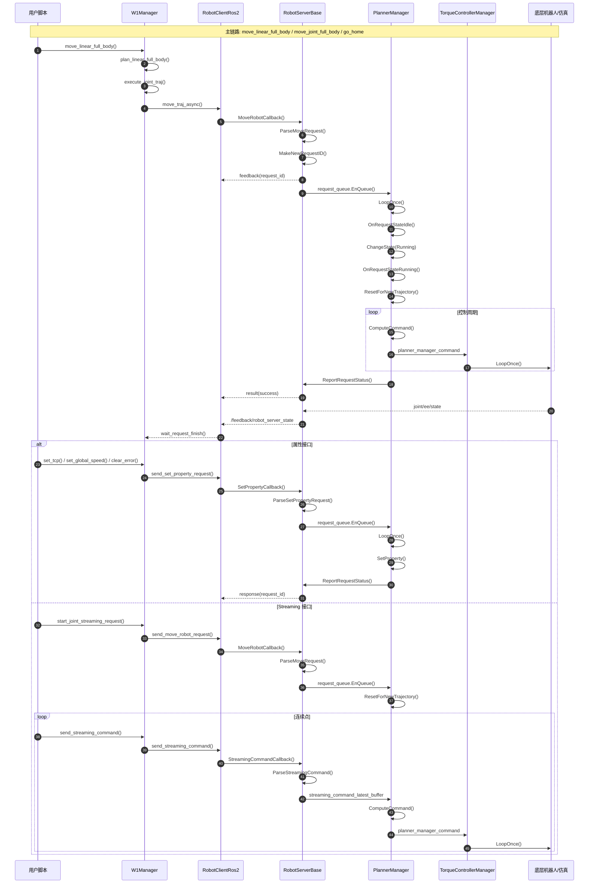

# Client/Server 时序图

只保留关键函数名，覆盖运动、属性、streaming 三条主路径。

```mermaid
sequenceDiagram
    autonumber
    participant U as 用户脚本
    participant W as W1Manager
    participant C as RobotClientRos2
    participant R as RobotServerBase
    participant P as PlannerManager
    participant T as TorqueControllerManager
    participant B as 底层机器人/仿真

    Note over U,B: 主链路: move_linear_full_body / move_joint_full_body / go_home

    U->>W: move_linear_full_body()
    W->>W: plan_linear_full_body()
    W->>W: execute_joint_traj()
    W->>C: move_traj_async()
    C->>R: MoveRobotCallback()
    R->>R: ParseMoveRequest()
    R->>R: MakeNewRequestID()
    R-->>C: feedback(request_id)
    R->>P: request_queue.EnQueue()
    P->>P: LoopOnce()
    P->>P: OnRequestStateIdle()
    P->>P: ChangeState(Running)
    P->>P: OnRequestStateRunning()
    P->>P: ResetForNewTrajectory()
    loop 控制周期
        P->>P: ComputeCommand()
        P->>T: planner_manager_command
        T->>B: LoopOnce()
    end
    P->>R: ReportRequestStatus()
    R-->>C: result(success)
    B-->>R: joint/ee/state
    R-->>C: /feedback/robot_server_state
    C-->>W: wait_request_finish()

    alt 属性接口
        U->>W: set_tcp() / set_global_speed() / clear_error()
        W->>C: send_set_property_request()
        C->>R: SetPropertyCallback()
        R->>R: ParseSetPropertyRequest()
        R->>P: request_queue.EnQueue()
        P->>P: LoopOnce()
        P->>P: SetProperty()
        P->>R: ReportRequestStatus()
        R-->>C: response(request_id)
    else Streaming 接口
        U->>W: start_joint_streaming_request()
        W->>C: send_move_robot_request()
        C->>R: MoveRobotCallback()
        R->>R: ParseMoveRequest()
        R->>P: request_queue.EnQueue()
        P->>P: ResetForNewTrajectory()
        loop 连续点
            U->>W: send_streaming_command()
            W->>C: send_streaming_command()
            C->>R: StreamingCommandCallback()
            R->>R: ParseStreamingCommand()
            R->>P: streaming_command_latest_buffer
            P->>P: ComputeCommand()
            P->>T: planner_manager_command
            T->>B: LoopOnce()
        end
    end
```
